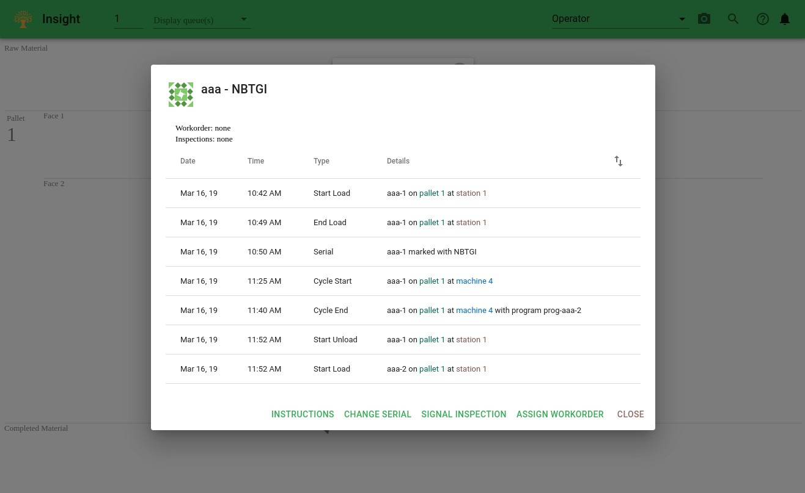
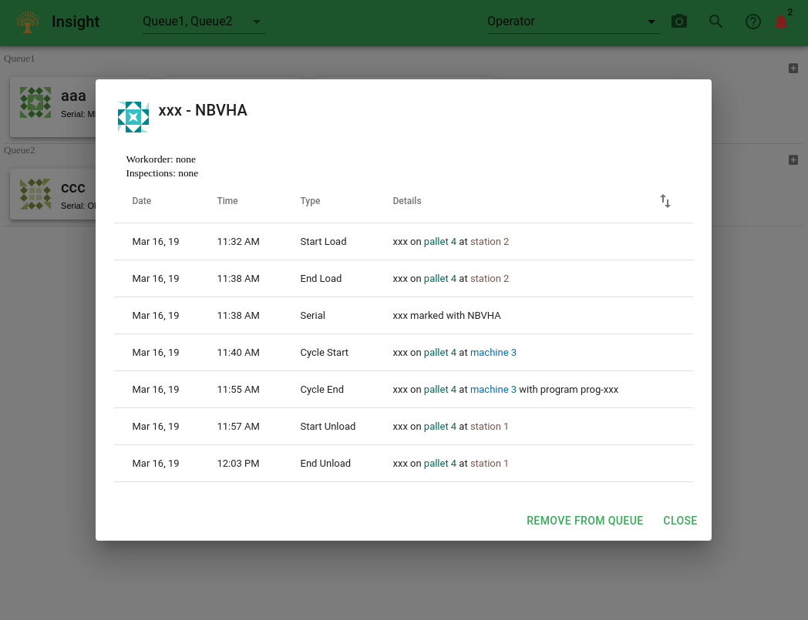
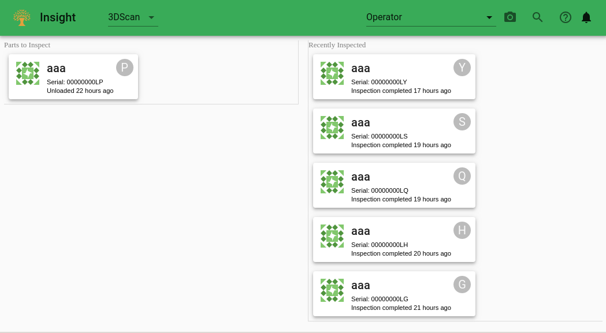
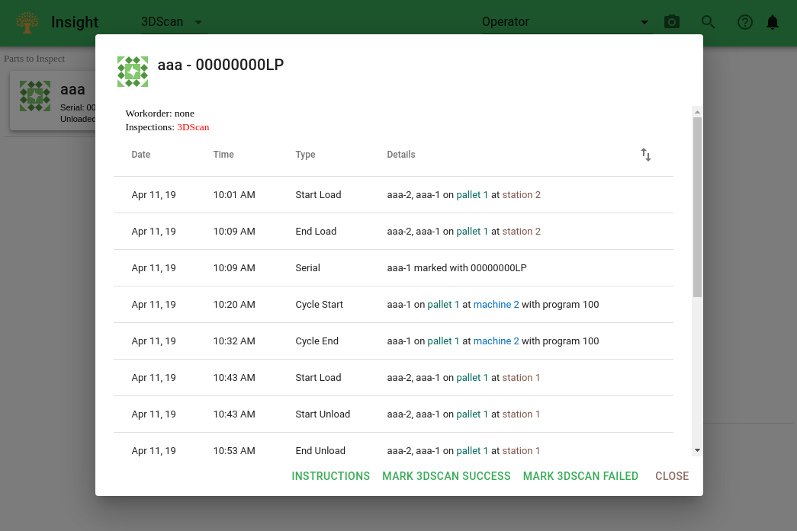
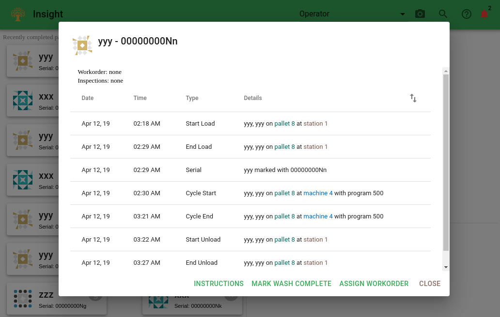

The station monitor pages are intended to be used on the shop floor by the operators;
these pages display the [virtual whiteboard of material
sticky notes](material-tracking.md). Each in-process piece of material is
represented by a virtual sticky note. On the sticky note, FMS Insight
displays the part name, serial, assigned workorder, and any signaled
inspections. The sticky note can be clicked or tapped to open a dialog with
more details about the material including the log of events. The dialog also
allows the operator to notify Insight of changes in the material, such as
completing wash or assigning a workorder. Finally, the sticky note contains
an identicon based on the part name and the final number/letter of the
serial.

We suggest that computers or mounted tablets be placed next to various stations
in the factory, perhaps with an attached barcode scanner.
The computer or mounted tablet can then be configured to open the specific screen
for the station by either bookmarking the page or just setting the specific page
as the homepage for the browser.

## Load Station

On the top toolbar, the specific load station number is set. Insight will display
only regions relevant to this specific load station, including the raw material region,
the faces of the pallet currently at the load station, and a region for completed material.
Optionally, the queues dropdown on the top toolbar can be used to add one to three virtual
whiteboard regions to display in addition to the pallet regions. Typically we suggest that
in-process queues have their own computer with a dedicated display, but for queues closely
associated with the load station such as a transfer stand, the virtual whiteboard region for
the queue can be displayed along with the pallet regions.

When a material sticky note is clicked or tapped, a dialog will open with a
log of events for the piece of material. The dialog can also be opened by
[using a scanner](client-scanners.md) or manually entering a serial via the
magnifying glass button on the toolbar. In the dialog, a serial can be
entered or changed, the part can be marked for inspection, assigned to a
workorder, and [load instructions](part-instructions.md) can be opened.

## Queues

The queues screen shows the material currently inside one or more queues. On the top toolbar,
one or more queues can be selected and the virtual whiteboard regions for the selected queues
are then displayed. The queue screen allows the operator to edit the material in the queue.
To add new material to the queue, click the plus icon button in the top-right of the queue
virtual whiteboard region. This will bring up a dialog allowing you to enter a serial,
scan a barcode, or manually select a job for the added material.

By clicking or tapping on a material sticky note, a dialog will open with
details about the specific piece of material. The dialog will have a button
at the bottom labeled "Remove From Queue".
An attached [barcode scanner](client-scanners.md) can also be used to open the material
dialog.

## Inspection

The inspection screen shows completed material that has been marked for inspection. On the top
toolbar, a specific inspection type can be selected or all material for inspection can be shown.
On the left is the virtual whiteboard region for completed but not yet inspected material and on
the right is material which has completed inspections.

When a material sticky note is clicked or tapped, a dialog will open with a
log of events for the piece of material. If a specific inspection type is
selected, there will be buttons to mark a piece of material as either
successfully inspected or failed. When clicked or tapped, this will record an
event in the log and move the virtual sticky note from the left to the right.
The top toolbar on the right allows an operator name to be entered and this
operator name will be attached to the created inspection completed log entry.
Finally, the operator can open [inspection instructions](part-instructions.md).

An attached [barcode scanner](client-scanners.md) can also be used to open the material
dialog. This allows viewing details and marking as inspected or uninspected
any part by scanned serial (even if the part is not on the screen).

## Wash

The wash screen shows completed material from the last 36 hours. On the left
is the virtual whiteboard region for completed but not yet washed material
and on the right is material which has completed final wash.

When a material sticky note is clicked or tapped, a dialog will open with a
log of events for the piece of material. There is a button to mark a piece of
material as completing wash. When clicked or tapped, this will record an
event in the log and move the virtual sticky note from the left to the right.
The top toolbar on the right allows an operator name to be entered and this
operator name will be attached to the created wash completed log entry.
Finally, the operator can open [wash instructions](part-instructions.md).

An attached [barcode scanner](client-scanners.md) can also be used to open the material
dialog. This allows viewing details and marking as wash completed
any part by scanned serial (even if the part is not on the screen because more than 36 hours has passed).
